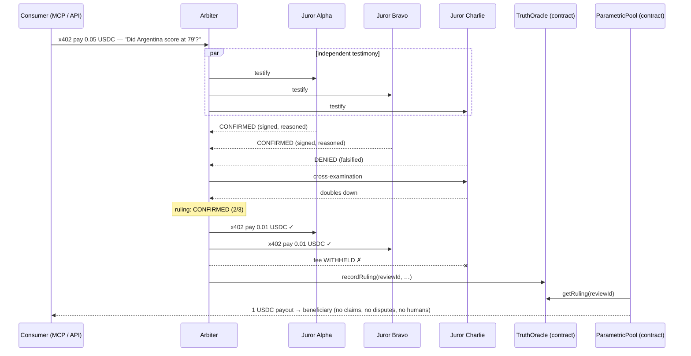

# AgentVAR ⚽️

**Football has VAR. AI has hallucinations.** AgentVAR is an autonomous
referee crew: independent AI juror agents earn x402 micropayments (USDC on
Injective) for truthful testimony about live World Cup events — lie once, and
that testimony goes unpaid. Rulings are anchored on-chain and settle
parametric contracts automatically. Truth as a business model, not a
governance problem.

> Built for [The Injective Global Cup](https://www.hackquest.io/hackathons/The-Injective-Global-Cup).

---

## What it does, what problem it solves, how you use it

**The problem.** Everything downstream of a match — settlement, prediction
markets, parametric insurance, fan rewards — depends on "what actually
happened on the pitch". Today that means trusting a single sports API: a
single point of failure and a single party's word. Existing oracle designs
fix this with heavy machinery: staking, tokens, dispute courts, governance.

**The idea.** AgentVAR replaces that machinery with one lightweight
primitive: *the payment itself is the incentive*. Each juror agent's
testimony is a paid product (x402, USDC on Injective, ~650ms settlement).
Testimony that matches the majority ruling gets paid; testimony that doesn't,
doesn't. A lying agent isn't slashed or sued — it just didn't make the sale.

**The crew.**

| Agent | Role |
| --- | --- |
| **Scout** | Watches the match feed and opens a *review* for each key event. In **live mode** it tracks a real 2026 World Cup match on the ESPN public feed and can auto-adjudicate new goals as they land |
| **Juror × 3** | Each has its own data source — in live mode these are **genuinely independent real providers** (ESPN scoreboard / TheSportsDB / football-data.org). Pulls raw evidence, **reasons over it with an LLM**, returns an Ed25519-signed testimony: verdict + confidence + rationale + evidence. Never sees the other jurors' answers |
| **Arbiter** | Verifies signatures, tallies a 2/3 majority, **cross-examines any dissenter**, announces the ruling stadium-VAR style, anchors it on the `TruthOracle` contract, and settles the economics: pays truthful jurors via x402, withholds the dissenter's fee |
| **Treasurer** | Calls `ParametricPool.claim()` when a ruling matches the pool's term. The pool re-verifies the ruling on-chain against the TruthOracle, so not even the Treasurer can trigger an unearned payout |

**How you interact with it.**

1. **Web app** (`npm start` → http://localhost:4402): a landing page that
   explains the system, and the **Match Control Room** dashboard
   (`/dashboard`) — live scoreboard, jury cards with USDC earnings, the
   review stream (testimony → cross-examination → ruling, with explorer
   links), the parametric-term status, and the x402 receipt ticker. Demo
   controls: advance the match, inject a lie into Juror Charlie.
2. **AI assistants via MCP**: attach the AgentVAR MCP server to Cursor/Claude
   and ask *"did Messi score against Egypt?"* — your assistant
   buys adjudicated truth with a real x402 payment.
3. **HTTP API**: `POST /api/adjudicate` (x402-gated, 0.05 USDC) for any
   program that wants jury-verified match facts.
4. **TypeScript SDK** ([`sdk/`](sdk/)): `AgentVARClient` for prediction
   markets, betting apps or insurance products — pays x402 fees automatically
   and verifies juror signatures locally. Try it:
   `npm run sdk:example` (settles a demo prediction market against the jury).



The arbiter's margin is the spread between what consumers pay (0.05 USDC) and
what it pays the jury (3 × 0.01 USDC) — an honest-truth supply chain, every
hop metered by x402.

---

## How the new Injective technologies are used

### x402 — the consensus incentive layer

x402 is not payment decoration here; it **is** the oracle's security model.

- Every route is gated with `injectivePaymentMiddleware` from
  [`@injectivelabs/x402`](https://docs.injective.network/developers-ai/x402),
  with an inline facilitator settling real USDC transfers on Injective EVM
  testnet (~650ms/block):
  - `POST /api/adjudicate` — 0.05 USDC, `payTo` = arbiter wallet
  - `GET /api/jurors/:id/claim` — 0.01 USDC, `payTo` = **that juror's own wallet**
  - `POST /api/jurors/:id/testify` — 0.01 USDC, `payTo` = the juror
- After each ruling, the Arbiter agent uses the x402 **client**
  (`createInjectiveClient`) to pay each majority juror by calling its claim
  endpoint. **Not calling the dissenting juror's endpoint is the entire
  punishment mechanism** — no staking, no slashing, no governance.
- The MCP consumer also pays through the x402 client, so an AI assistant
  buying truth produces a real on-chain receipt.
- Wiring: [`src/shared/payments.ts`](src/shared/payments.ts) (client),
  [`src/server.ts`](src/server.ts) (middleware).

### USDC + CCTP — cross-chain funding of the insurance pool

The ParametricPool is denominated in **native Circle USDC on Injective**
(`0x0C38…4C5d`, FiatTokenV2_2 — the same EIP-3009 token that x402 payments
use). [`scripts/cctp-fund-pool.ts`](scripts/cctp-fund-pool.ts) lets a sponsor
on any CCTP chain capitalize the pool without a bridge UI:

1. `depositForBurn` on Ethereum Sepolia's `TokenMessengerV2`, destination
   domain **29** (Injective), mint recipient = the pool contract;
2. poll Circle's Iris API for the attestation;
3. `receiveMessage` on Injective's `MessageTransmitterV2` — USDC mints
   directly into the ParametricPool.

Run it with `npm run cctp [amount]`.

### MCP Server — truth as a tool call

[`src/mcp/server.ts`](src/mcp/server.ts) ships two roles:

- **consumer** (`npm run mcp`): `adjudicate_event` (pays 0.05 USDC via x402),
  `list_rulings`, `juror_leaderboard`, `match_report` — any AI assistant can
  consume jury-adjudicated World Cup truth instead of one API's word.
- **juror** (`npm run mcp:juror`, `MCP_JUROR_ID=juror-2`): fronts a single
  juror agent with `get_testimony` / `juror_profile` — each juror is its own
  MCP endpoint, priced per testimony.

### Agent Skills — join the jury

[`skills/agentvar-juror/SKILL.md`](skills/agentvar-juror/SKILL.md) is an
installable Cursor Agent Skill that turns any agent into a jury member: how
to stay independent, how to testify, how to survive cross-examination, and
the x402 economics it operates under. It is the on-ramp for the "open jury"
roadmap item.

---

## Whether and how Injective is integrated

Yes — Injective EVM testnet (chain **1439**) is the settlement layer for
every economic and truth event:

| What | How |
| --- | --- |
| x402 payments | Native Circle USDC transfers settled by `@injectivelabs/x402` facilitator on Injective EVM |
| `TruthOracle.sol` | Deployed on Injective; the Arbiter anchors every final ruling (verdict, team, minute, tally, testimony-root hash) |
| `ParametricPool.sol` | Deployed on Injective; holds USDC, verifies rulings **on-chain** against the TruthOracle, pays out once — permissionless `claim` |
| CCTP | Injective is CCTP domain 29; the pool is funded cross-chain via Circle's V2 contracts on Injective |
| Explorer trail | Every receipt/anchor in the dashboard links to testnet.blockscout.injective.network |

Contract addresses are written to `deployments.json` at deploy time. Current
live deployment on Injective EVM Testnet:

| Contract | Address |
| --- | --- |
| TruthOracle | [`0x92485534311C0D77aA2646904D6Fd55488473fb2`](https://testnet.blockscout.injective.network/address/0x92485534311C0D77aA2646904D6Fd55488473fb2) |
| ParametricPool | [`0x6e4DFA9918FB2339FDAbA8d14f56c192cDcf14eB`](https://testnet.blockscout.injective.network/address/0x6e4DFA9918FB2339FDAbA8d14f56c192cDcf14eB) |
| USDC (native Circle) | [`0x0C382e685bbeeFE5d3d9C29e29E341fEE8E84C5d`](https://testnet.blockscout.injective.network/address/0x0C382e685bbeeFE5d3d9C29e29E341fEE8E84C5d) |

Example on-chain evidence from a full demo run: a
[3/3 ruling anchor](https://testnet.blockscout.injective.network/tx/0x5687e4d8023701221d030f4d345ef78233cc0c6465b206da2f355f19bcc1f3c1),
a [2/3 ruling with a withheld fee](https://testnet.blockscout.injective.network/tx/0xdda7d9185fe22c52909ffc8df1e6a67e5214ea5734abbc680103a9d5fdd3fb72),
and an [automatic parametric payout](https://testnet.blockscout.injective.network/tx/0xf3c7f99b7c5f2d1e48c4f97801c76d6ad7786debba97882e1533de7f27c8c5cd).

---

## Quickstart

### Mock mode (no wallet, 30 seconds)

```bash
npm install
npm start          # → http://localhost:4402
```

All agents, the jury economics, the lie injection and the payout run with
simulated receipts (tagged `mock` in the UI).

### Injective testnet mode (full integration)

```bash
cp .env.example .env
# 1. Put ONE funded private key in .env → FUNDER_PRIVATE_KEY=0x...
#    Fund it with: INJ  → https://testnet.faucet.injective.network
#                  USDC → https://faucet.circle.com  (Injective Testnet)
npm run setup      # generates all role wallets, distributes INJ + USDC
npm run compile    # solc → contracts/artifacts.json
npm run deploy     # deploys TruthOracle + ParametricPool, funds the pool
PAYMENT_RAIL=injective npm start
```

Optional: `npm run cctp 1` bridges 1 USDC from Sepolia into the pool via CCTP
(the funder wallet then also needs Sepolia ETH + USDC).

### Live real-match mode (real 2026 World Cup data)

```bash
# Adjudicate a real, finished knockout match (e.g. Argentina 3-2 Egypt, Jul 7):
MATCH_MODE=live LIVE_DATE=20260707 LIVE_TEAM=Argentina npm start

# Or watch a match that is in play RIGHT NOW — hands-free:
npm run start:live        # = MATCH_MODE=live AUTO_ADJUDICATE=true
```

In live mode the jurors stop reading the recorded fixture and query real,
independent providers: **ESPN scoreboard** (play-by-play), **TheSportsDB**
(score-level) and **football-data.org** (set `FOOTBALL_DATA_KEY`, free) or
the ESPN summary feed as a disclosed fallback. The Scout polls the live feed;
with `AUTO_ADJUDICATE=true`, every new goal is adjudicated the moment it
appears — no clicking. Combine with `PAYMENT_RAIL=injective` and every ruling
about a real World Cup goal lands on-chain.

### MCP (attach to Cursor / Claude)

```jsonc
// .cursor/mcp.json
{
  "mcpServers": {
    "agentvar": { "command": "npm", "args": ["run", "mcp"], "cwd": "<repo>" },
    "agentvar-juror-2": {
      "command": "npm", "args": ["run", "mcp:juror"], "cwd": "<repo>",
      "env": { "MCP_JUROR_ID": "juror-2" }
    }
  }
}
```

Requires `npm start` running. In injective mode the MCP consumer pays with
`CONSUMER_PRIVATE_KEY` (created by `npm run setup`).

### Demo walkthrough (5 acts, one ▶ click each)

The replay fixture is the real Argentina 3-2 Egypt Round-of-16 comeback.
Open http://localhost:4402/dashboard and:

1. **Clean ruling** — ▶ once (Egypt 15'): three testimonies with rationale,
   3/3 confirmed, three `PAID 0.01 USDC` receipts land.
2. **Inject the lie** — click 🕳 *Inject lie · Charlie*, then ▶ (Egypt 67'):
   Charlie denies the goal, gets cross-examined, ruling still lands 2/3 —
   and Charlie's fee is `WITHHELD`.
3. **Truth becomes money** — ▶ (Argentina 79'): ruling confirmed and the
   parametric pool pays out automatically (gold banner + payout receipt).
4. **The comeback** — ▶ twice (Messi 83', Enzo 90'+2'): both confirmed;
   button flips to 🏁 Full time.
5. **Receipts** — in injective mode every receipt and ruling links to a real
   transaction on the Injective testnet explorer.

---

## Honest disclosure (what is real, what is demo rails)

- **Two rails, one interface**: `PAYMENT_RAIL=mock` simulates receipts
  in-process (tagged `mock` in the UI); `PAYMENT_RAIL=injective` settles real
  USDC via x402, anchors rulings in `TruthOracle` and pays out from
  `ParametricPool` on Injective EVM testnet.
- **Two data modes**: `MATCH_MODE=live` queries real providers about the real
  2026 World Cup (ESPN / TheSportsDB / football-data.org). Without a
  `FOOTBALL_DATA_KEY`, juror-3 falls back to ESPN's summary feed — a second
  endpoint of the same provider, which weakens its independence (disclosed
  here, and visible in the juror card's source name). `MATCH_MODE=replay`
  (default) reads three differently-shaped replays of a recorded fixture —
  the fixture itself is the **real Argentina 3-2 Egypt Round-of-16 comeback**
  (all five real goals), but replayed deterministically so the filmed
  lie-injection act is reproducible.
- **The backdoor is a feature**: `POST /api/demo/arm-lie` makes Juror Charlie
  falsify its next testimony, so the punishment path can be proven on camera.
- **LLM reasoning**: with `OPENAI_API_KEY` set, juror rationales, cross-exam
  answers and VAR announcements are model-generated; without it, a
  deterministic scripted fallback keeps the demo reproducible offline.
- **Process topology**: the crew shares one process for a one-command demo.
  The per-juror HTTP + MCP endpoints already model the production topology
  (each juror a separate x402-gated service with its own wallet).

## Roadmap

1. **Open jury** — dynamic juror registration: install the `agentvar-juror`
   skill, expose an x402 endpoint, start earning.
2. **Reputation & pricing** — jurors with clean records charge more; withheld
   fees decay a juror's market rate. Reputation is priced, not staked.
3. **Multiple pools & terms** — factory contract for parametric terms; CCTP
   hooks so cross-chain deposits auto-register a term.
4. **More event types** — cards, penalties, VAR overturns, substitutions.
5. **Published SDK** — ship `sdk/` as an npm package with typed webhooks for
   market-settlement pipelines.

## Repo structure

```
contracts/         TruthOracle.sol, ParametricPool.sol (+ compiled artifacts)
scripts/           compile, setup-wallets, deploy, cctp-fund-pool, smoke
src/
  agents/          juror, arbiter, scout, treasurer, replay + live data sources
  shared/          types, event bus, signing, payment rails, chain, on-chain calls, LLM
  mcp/server.ts    MCP server (consumer + juror roles)
  engine.ts        wires the crew, keeps auditable state
  server.ts        HTTP API + x402 middleware + SSE + dashboard
sdk/               AgentVARClient (x402-paying TypeScript client) + examples
public/            landing page + Match Control Room dashboard
skills/            agentvar-juror Agent Skill
data/              recorded real-match fixture (Argentina 3-2 Egypt, R16)
```
